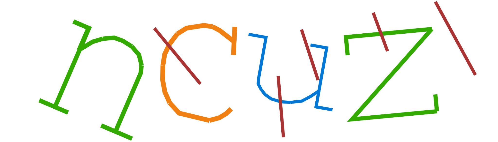
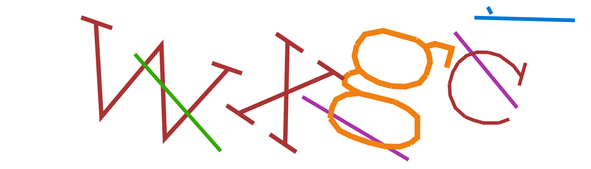

# BioSvg

Captcha based on SVG.

## Original idea

[SVG绘制原理与验证码](https://blog.woooo.tech/posts/svg_1/)

## Usage

`cargo add biosvg`

```rust
let (answer, svg) = BiosvgBuilder::new()
    .length(4)
    .difficulty(6)
    .colors(vec![
        "#0078D6".to_string(),
        "#aa3333".to_string(),
        "#f08012".to_string(),
        "#33aa00".to_string(),
        "#aa33aa".to_string(),
    ])
    .build()
    .unwrap();
println!("answer: {}", answer);
println!("svg: {}", svg);
```

## Example



